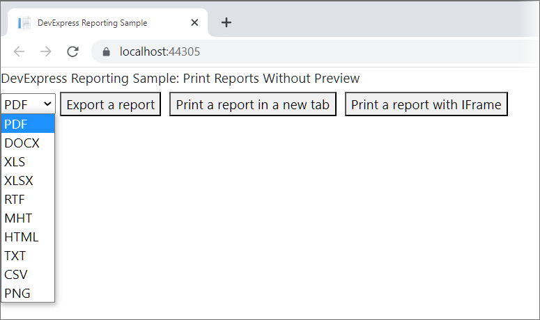

<!-- default badges list -->

<!-- default badges end -->
# Reporting for React - Print and Export Without Displaying the Report

This example prints and exports a report in a browser without previewing it on a web page.

## Print

On the **server side**, a controller performs the following actions:
- [creates a report](https://docs.devexpress.com/XtraReports/2440/get-started-with-devexpress-reporting/create-a-report-from-a-to-z);
- [exports the report to PDF](https://docs.devexpress.com/XtraReports/2574/detailed-guide-to-devexpress-reporting/store-and-distribute-reports/export-reports/export-to-pdf) with the [XtraReport.ExportToPdfAsync](https://docs.devexpress.com/XtraReports/DevExpress.XtraReports.UI.XtraReport.ExportToPdfAsync.overloads) method;
- sends the PDF file back to the client.

On the **client-side**, a user can do one of the following:

* Print a report in a new tab.
Click a button to call the client-side `window.Open(url, "_blank")` method to open a new window that contains a PDF file and print the window content.

* Print a report in iFrame. 
Click a button to load a PDF file in the `HTMLIFrameElement` and print its content.

## Export

The user selects the format and clicks a button to send the format to the server-side controller. The controller calls the export method for the selected format and sends the file back to the browser.

## Files to Review

- [HomeComponent.jsx](dxSampleReactReportingPrintWithoutPreview/ClientApp/src/components/HomeComponent.jsx)
- [HomeController.cs](dxSampleReactReportingPrintWithoutPreview/Controllers/HomeController.cs)

## Documentation

* [Reporting for React](https://docs.devexpress.com/XtraReports/401915/web-reporting/javascript-reporting/react)
* [Export Reports](https://docs.devexpress.com/XtraReports/1302/detailed-guide-to-devexpress-reporting/store-and-distribute-reports/export-reports)

## More Examples

- [Reporting for Web (React) - Report Designer](https://github.com/DevExpress-Examples/reporting-eud-designer-in-javascript-with-react)
- [Reporting for Web (React) - Document Viewer](https://github.com/DevExpress-Examples/reporting-document-viewer-in-javascript-with-react)
- [How to Print and Export a Report in the ASP.NET Core Application without the Document Viewer](https://github.com/DevExpress-Examples/Reporting-AspNetCore-Print-Without-Preview)
<!-- feedback -->
## Does this example address your development requirements/objectives?

 

(you will be redirected to DevExpress.com to submit your response)
<!-- feedback end -->
